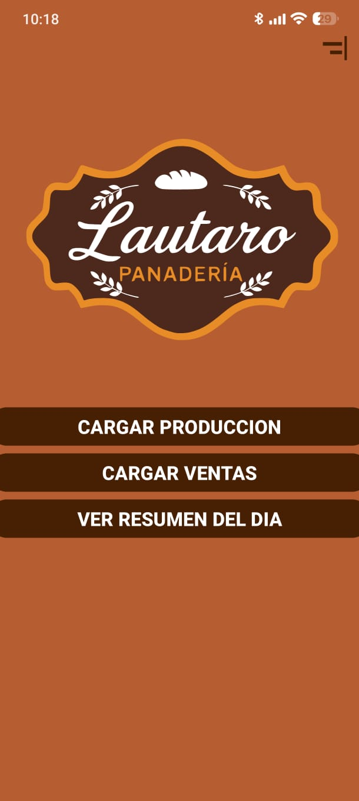
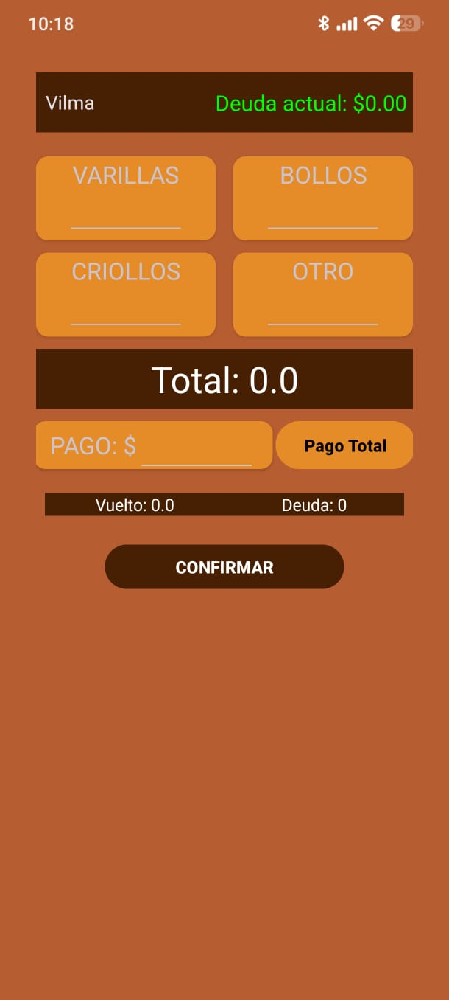

# 🥖 Panadería Lautaro - App de Gestión

Aplicación Android desarrollada en Kotlin para la gestión de ventas y clientes en una panadería.  
Permite registrar ventas, calcular deudas automáticamente y visualizar historial de operaciones.

---

## 🚀 Funcionalidades

- 📦 Registro de ventas
- 👥 Gestión de clientes (crear, editar, activar/inactivar)
- 🧮 Cálculo automático de totales
- 💰 Cálculo de vuelto y deuda
- 📊 Historial de ventas
- 🔍 Filtro de ventas por cliente
- 📉 Cálculo automático de deuda acumulada
- ➕ Soporte para operaciones matemáticas (ej: `2+1`)

---

## 🛠️ Tecnologías utilizadas

- Kotlin
- Android SDK
- Room (Base de datos local)
- RecyclerView
- Coroutines

---

## 📸 Capturas de la aplicación

### 🧾 Pantalla de inicio

### 👥 Gestión de Venta

### 📊 Historial de ventas

---

## 📦 Instalación

